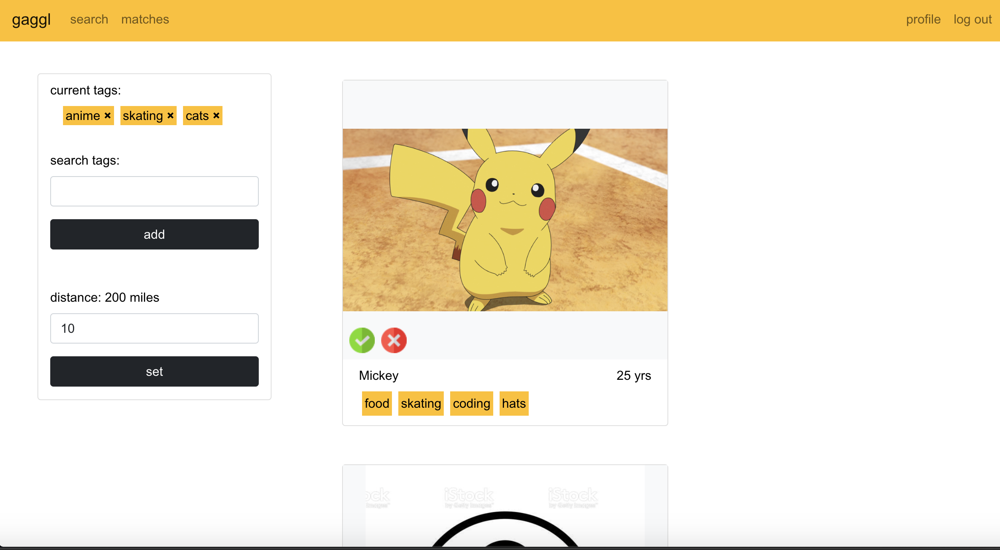
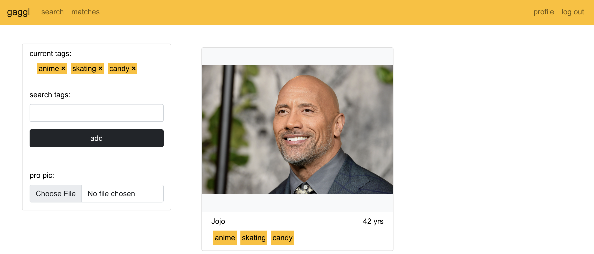
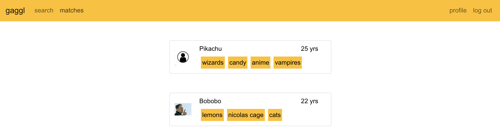

# gaggl - friend matching app
### proof of concept / practice for React & Kafka

Find friends sorted by how much in common they have with you. Add tags to your profile representing interests and characteristics. Then select tags to search with for potential friends, which will be sorted by how many tags match what you search. Scroll through the results and check the ones you are interested in.

A worker consumes user location change events and saves the location in elasticsearch, which can efficiently be searched on using elasticsearch capabilities. And a python worker consumes user "like" events and produces a match event which will be consumed by a mongodb sink connector to save the match. Architecture loosely based off Tinder's.

A gaggle is a flock of geese.

## tools
- react
- bootstrap
- vanilla node js
- mongodb
- mongodb sink connector
- redis
- elasticsearch
- kafka
- python
- google cloud platform bucket

## to run
run zookeeper, kafka, and the sink connector ie `bin/connect-standalone.sh config/connect-standalone.properties plugins/mongodb-kafka-connect-mongodb-1.6.0/etc/MongoSinkConnector.properties`

```
cd gaggl-api
npm i
npm start

cd ../gaggl-ui
npm i
npm start 

cd ../gaggl-geo-worker
npm i
node index.js

cd ../gaggl_like_worker
pip install -r requirements
python3 src/app.py
```

## screenshots
  



## sources
- https://techtakshila.com/system-design-interview/chapter-5/
- https://medium.com/analytics-vidhya/geospatial-data-with-elasticsearch-c7d3d5e51918
- https://www.bezkoder.com/react-refresh-token/
- https://www.bezkoder.com/react-typescript-authentication-example/#Add_Navbar_and_define_Routes

<a href="https://www.flaticon.com/free-icons/correct" title="correct icons">Correct icons created by Freepik - Flaticon</a>